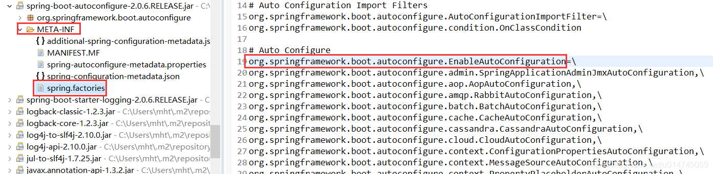

********## **Java原子类**
## **Spring注入方式**
### setter注入(*setArrtributeName()*) 
<https://www.cnblogs.com/tuyang1129/p/12873492.html>
```xml
<!-- 定义car这个bean，id为myCar -->
<bean id="myCar" class="cn.tewuyiang.pojo.Car">
    <!-- 
        为car的属性注入值，因为speed和price都是基本数据类型，所以使用value为属性设置值；
        注意，这里的name为speed和price，不是因为属性名就是speed和price，
        而是set方法分别为setSpeed和setPrice，名称是通过将set删除，然后将第一个字母变小写得出；
    -->
    <property name="speed" value="100"/>
    <property name="price" value="99999.9"/>
</bean>

<!-- 定义user这个bean -->
<bean id="user" class="cn.tewuyiang.pojo.User">
    <property name="name" value="aaa" />
    <property name="age" value="123" />
    <!-- car是引用类型，所以这里使用ref为其注入值，注入的就是上面定义的myCar 
         基本数据类型或Java包装类型使用value，
         而引用类型使用ref，引用另外一个bean的id 
    -->
    <property name="car" ref="myCar" />
</bean>

```
### 构造器注入
```xml
<bean id="myCar" class="cn.tewuyiang.pojo.Car">
    <!-- 通过constructor-arg的name属性，指定构造器参数的名称，为参数赋值 -->
    <constructor-arg name="speed" value="100" />
    <constructor-arg name="price" value="99999.9"/>
</bean>

<bean id="user" class="cn.tewuyiang.pojo.User">
    <constructor-arg name="name" value="aaa" />
    <constructor-arg name="age" value="123" />
    <!-- 
         和之前一样，基本数据类型或Java包装类型使用value，
         而引用类型使用ref，引用另外一个bean的id 
    -->
    <constructor-arg name="car" ref="myCar" />
</bean>
```
property的name属性，是通过set方法的名称得来；而constructor-arg的name，则是构造器参数的名称。
### 静态工厂注入
静态工厂注入就是我们编写一个静态的工厂方法，这个工厂方法会返回一个我们需要的值，然后在配置文件中，我们指定使用这个工厂方法创建bean。首先我们需要一个静态工厂，如下所示：
```java
public class SimpleFactory {

    /**
     * 静态工厂，返回一个Car的实例对象
     */
    public static Car getCar() {
        return new Car(12345, 5.4321);
    }
}

```

```xml
<bean id="car" class="cn.tewuyiang.factory.SimpleFactory" factory-method="getCar"/>

<bean id="user" class="cn.tewuyiang.pojo.User">
    <!-- name和age使用set注入 -->
    <property name="name" value="aaa"/>
    <property name="age" value="123"/>
    <!-- 将上面配置的car，注入到user的car属性中 -->
    <property name="car" ref="car"/>
</bean>
```
```java
@Test
public void test1() {
    ApplicationContext context =
        new ClassPathXmlApplicationContext("classpath:applicationContext.xml");
    // 获取静态工厂创建的car
    Car car = (Car) context.getBean("car");
    // 获取user
    User user = context.getBean(User.class);
    System.out.println(car);
    System.out.println(user);
}

```
## **Spring Boot循环依赖**
如果UserServiceImpl注入了TeacherServiceImpl，TeacherServiceImpl注入了UserServiceImpl，只需要在其中一个注入的@Autowired后面加一个@Lazy就可以。
如果我们想要 Spring 在启动的时候延迟加载 bean，即在调用某个 bean 的时候再去初始化，那么就可以使用 @Lazy 注解。
## **@Transactional注解**
如下有一个保存用户的方法，加入 @Transactional 注解，使用默认配置，抛出异常之后，事务会自动回滚，数据不会插入到数据库。
## **Spring组件**
### Bean组件
- 组件作用   
  Bean组件在Spring中的Beans包下，为了解决三件事。Bean的创建，Bean的定义，Bean的解析。最关心的就是Bean的创建。
Bean的创建
1. 工厂模式的实现，顶层接口是：BeanFactory, 虽然最终实现类是DefaultListableBeanFactory，但是其上层接口都是为了区分在Spring内部对象的传递和转换的过程，对对象的数据访问所做的限制。   
2. ListableBeanFactory：可列表的
3. HierarchicalBeanFactory：可继承的
4. AutowriteCapableBeanFactory：可自动装配的

- 这四个接口，共同定义了Bean的集合，Bean之间的关系，Bean的行为。
- Bean的定义
    Bean的定义完整的描述在Spring配置文件中节点中，包括子节点等。在Spring内部它被转换成BeanDefinition对象，后续操作都是对这个对象操作。主要是BeanDefinition来描述
- Bean的解析
    BeanDefinitionReader
    Bean的解析就是对Spring配置文件以及对Tag的解析。
### Context组件
- 组件作用
    在Spring中的context包下，为Spring提供运行环境，用以保存各个对象状态。
    Context作为Spring的IOC容器，整合了大部分功能或说大部分功能的基础，完成了以下几件事：
  1. 标识一个应用环境
  2. 利用BeanFactory创建Bean对象
  3. 保存对象关系表
  4. 能够捕获各种事件
- ApplicationContext是context的顶级父类，除了能标识一个应用的基本信息外，还继承了五个接口，扩展了Context的功能。并且继承了BeanFactory，说明Spring容器中运行的主体对象是Bean，另外还继承了ResourceLoader，可以让ApplicationContext可以访问任何外部资源。
  
- ApplicationContext子类
1. ConfigurableApplicationContext：表示Context是可以修改的，在构建Context，用户可以动态添加或者修改已有的配置。
2. WebApplicationContext：为Web准备的Context，可以访问ServletContext。
### Core组件
- 访问资源
   1. 它包含了很多关键类，一个重要的组成部分就是定义的资源的访问方式，这种把所有资源都抽象成了一个接口的方式很值得学习。
   2. Resource接口封装了各种可能的资源类型，继承了InputStreamSource接口。加载资源的问题，也就是资源加载者的统一，由ResourceLoader接口来完成。默认实现是：DefaultResourceLoader

- Core资源的加载
    Core组件将解析等工作委托给了ResourcePatternResolver来完成，作为一个接头人，把资源的加载，解析和定义整合在了一起便于其他组件使用。
## **JDK1.8新特性**       
- Lambda表达式
- 函数式接口
- 方法引用和构造器调用
- Stream API
- 接口中的默认方法和静态方法
- 新时间日期API

## **Spring Boot读取配置文件**
1. @Value("${property}）
2. 通过@ConfigurationProperties读取并与 bean 绑定
配合@Component 注解，我们可以像使用普通 bean 一样将其注入到类中使用。
3. 没有加 @Component注解时，需要配合使用@EnableConfigurationProperties注册我们的配置 bean
4. @PropertySource读取指定 properties 文件

## **@Component和@Bean**
- @Component注解表明一个类会作为组件类，并告知Spring要为这个类创建bean，@Component（@Controller、@Service、@Repository）通常是通过类路径扫描来自动侦测以及自动装配到Spring容器中。
- @Bean注解告诉Spring这个方法将会返回一个对象，这个对象要注册为Spring应用上下文中的bean。通常方法体中包含了最终产生bean实例的逻辑，并且实例名就是方法名。
- 两者都可以通过@Autowired装配
  
如果你想要将第三方库中的组件装配到你的应用中，在这种情况下，是没有办法在它的类上添加@Component注解的，因此就不能使用自动化装配的方案了，但是我们可以使用@Bean,当然也可以使用XML配置

## **@Resource和@Autowired**
- @Autowired由spring提供，默认按照byType注入，配和@Qualifier注解使用，可以按照byName注入
- @Resource和有java提供，默认按照byName注入
- @Resource不允许bean不存在的情况，@Autowired可以（@Autowired(required = false)）
  
所以当接口只有单一实现时，两者可以互换。


## **多线程的session或者session存储较大值怎么办**
- 使用redis

## **Group by having**
- GROUP BY 这个关键字的作用是根据一个字段进行分组，去重。
- 可以看出 HAVING 条件，是在 GROUP BY 分组后进行的筛选。
- having 子句是聚组函数唯一出现的地方，在where 子句中不能使用聚组函数。 
  
## **快排和冒泡**
时间复杂度：
- 快排：nlog
- 冒泡：n<sup>2</sup>

越混乱越用快排

## **数据库索引**
- 当前元组的不太复杂时，不要加索引

## **如何具体实现分页分表**

## **序列化**
1. 要被序列化的类要实现Serializable接口
2. 再写一个操作类，通过流（文件）实现序列化
3. 当serialVersionUID不存在是，java会自己创建一个serialVersionUID，但是需求改动，需要在本地类中添加其他的字段，这个时候再反序列化时便会出现serialVersionUID不一致，导致反序列化失败。所以一般要自己创建一需求改动，需要在本地类中添加其他的字段，这个时候再反序列化时便会出现serialVersionUID不一致，导致反序列化失败。所以一般要自己创建一个serialVersionUID。
4. 对于不想进行序列化的变量，使用 transient 关键字修饰。
   - 一旦变量被transient修饰，变量将不再是对象持久化的一部分，该变量内容在序列化后无法获得访问
   - transient关键字只能修饰变量，而不能修饰方法和类。
   - 一个静态变量不管是否被transient修饰，均不能被序列化。
```java
 private static final long serialVersionUID = 1L;
```
## **Mysql join**
1. Mysql通过join构建一张大表，包含两张表的所有字段
   - **INNER JOIN（内连接,或等值连接）**：获取两个表中字段匹配关系的记录(等于join)
   - **LEFT JOIN（左连接）**：获取左表所有记录，即使右表没有对应匹配的记录。
   - **RIGHT JOIN（右连接）**： 与 LEFT JOIN 相反，用于获取右表所有记录，即使左表没有对应匹配的记录。
```
SELECT * FROM runoob_tbl a JOIN tcount_tbl b ON a.runoob_author = b.runoob_author;
```

## **Http**
- request
  请求行，消息头，消息体
- reponse
  状态行，消息头，消息体
- GET 数据放在URL里 ?username=wujian&password=123
- POST 数据放在body里

## **ThreadLocal**
- ThreadLocal 内部维护的是⼀个当前线程的ThreadLocalMap类型的Map局部变量， key为当前对象的
Threadlocal对象，value为entry对象。
- 因为value是被ThreadLocal弱引用的，所以在gc后，value会变为null，而由于threadLocal一般是static，所不会被gc，从而导致内存泄漏，因此在线程结束后，如果不再使用threadLocal，要调用remove进行清除。

## **javav IO**
- BIO 阻塞IO，面向流 socket 读写数据时，其他操作要挂起
- NIO 异步IO，面向缓存 读写数据时，其他操作不需要挂起

## **创建线程池**
《阿⾥巴巴Java开发⼿册》中强制线程池不允许使⽤ Executors 去创建，⽽是通过
ThreadPoolExecutor 的⽅式，这样的处理⽅式让写的同学更加明确线程池的运⾏规则，规避资源耗尽
的⻛险
## **AOP**
- Spring AOP 属于运行时增强，而 AspectJ 是编译时增强。 Spring AOP 基于代理(Proxying)，而 AspectJ 基于字节码操作(Bytecode Manipulation)。
- 如果我们的切面比较少，那么两者性能差异不大。但是，当切面太多的话，最好选择 AspectJ ，它比Spring AOP 快很多

## **浅谈springboot内置tomcat和外部独立部署tomcat的区别**
- tomcat修改配置会比springboot方便一些，毕竟springboot要写类，写配置再打包，再启动。
- 独立部署tomcat可以部署多个项目然后映射在同一个ip
- 部署更方便？tomcat上我们丢war包上去后，他会自动地去解包启动，可以不需要重启tomcat或者可以只替换某个文件部署，springboot的话需要重新打包再重启。

## **MySQL主从数据库**

## **什么是Spring容器**
- 一个Spring容器就是某个实现了ApplicationContext接口的类的实例。也就是说，从代码层面，Spring容器其实就是一个ApplicationContext。
- 在普通的JAVA工程中，我们可以通过代码显式new一个ClassPathXmlApplicationContext或者FileSystemXmlApplicationContext来初始化一个Spring容器。


## **SpringBoot如何实现自动装配**
Spring Boot启动的时候会通过@EnableAutoConfiguration注解找到META-INF/spring.factories配置文件中的所有自动配置类，并对其进行加载，而这些自动配置类都是以AutoConfiguration结尾来命名的，它实际上就是一个JavaConfig形式的Spring容器配置类，它能通过以Properties结尾命名的类中取得在全局配置文件中配置的属性如：server.port，而XxxxProperties类是通过@ConfigurationProperties注解与全局配置文件中对应的属性进行绑定的。
- Spring Boot关于自动配置的源码在spring-boot-autoconfigure-x.x.x.x.jar中
- @SpringBootApplication是一个复合注解或派生注解，在@SpringBootApplication中有一个注解@EnableAutoConfiguration，翻译成人话就是开启自动配置
- 而这个注解也是一个派生注解，其中的关键功能由@Import提供，其导入的AutoConfigurationImportSelector的selectImports()方法通过SpringFactoriesLoader.loadFactoryNames()扫描所有**具有**META-INF/spring.factories的jar包。spring-boot-autoconfigure-x.x.x.x.jar里就有一个这样的spring.factories文件。
- 这个spring.factories文件也是一组一组的key=value的形式，其中一个key是EnableAutoConfiguration类的全类名，而它的value是一个xxxxAutoConfiguration的类名的列表，这些类名以逗号分隔，如下图所示：

- 这个@EnableAutoConfiguration注解通过@SpringBootApplication被间接的标记在了Spring Boot的启动类上。在SpringApplication.run(...)的内部就会执行selectImports()方法，找到所有JavaConfig自动配置类的全限定名对应的class，然后将所有自动配置类加载到Spring容器中。
 
至此，我们大致可以了解。在全局配置的属性如：server.port等，通过@ConfigurationProperties注解，绑定到对应的XxxxProperties配置实体类上封装为一个bean，然后再通过@EnableConfigurationProperties注解导入到Spring容器中。


```java
我们先看注解@SpringBootApplication,它里面包含一个@EnableAutoConfiguration
继续看@EnableAutoConfiguration注解
@Import({AutoConfigurationImportSelector.class})
在这个类(AutoConfigurationImportSelector)里面实现了自动配置的加载

主要代码片段:
String[] selectImports(AnnotationMetadata annotationMetadata)方法中
AutoConfigurationImportSelector.AutoConfigurationEntry autoConfigurationEntry = this.getAutoConfigurationEntry(autoConfigurationMetadata, annotationMetadata);
	
getAutoConfigurationEntry方法中:	
List<String> configurations = this.getCandidateConfigurations(annotationMetadata, attributes);	

protected List<String> getCandidateConfigurations(AnnotationMetadata metadata, AnnotationAttributes attributes) {
        List<String> configurations = SpringFactoriesLoader.loadFactoryNames(this.getSpringFactoriesLoaderFactoryClass(), this.getBeanClassLoader());
        Assert.notEmpty(configurations, "No auto configuration classes found in META-INF/spring.factories. If you are using a custom packaging, make sure that file is correct.");
        return configurations;
}

最后会通过SpringFactoriesLoader.loadSpringFactories去加载META-INF/spring.factories
Enumeration<URL> urls = classLoader != null ? classLoader.getResources("META-INF/spring.factories") : ClassLoader.getSystemResources("META-INF/spring.factories");
                LinkedMultiValueMap result = new LinkedMultiValueMap();

                while(urls.hasMoreElements()) {
                    URL url = (URL)urls.nextElement();
                    UrlResource resource = new UrlResource(url);
                    Properties properties = PropertiesLoaderUtils.loadProperties(resource);
                    Iterator var6 = properties.entrySet().iterator();

                    while(var6.hasNext()) {
                        Entry<?, ?> entry = (Entry)var6.next();
                        String factoryClassName = ((String)entry.getKey()).trim();
                        String[] var9 = StringUtils.commaDelimitedListToStringArray((String)entry.getValue());
                        int var10 = var9.length;

                        for(int var11 = 0; var11 < var10; ++var11) {
                            String factoryName = var9[var11];
                            result.add(factoryClassName, factoryName.trim());
                        }
                    }
                }


```

## **Java浅拷贝深拷贝**
### 浅拷贝
- 创建一个新对象，然后将当前对象的非静态字段复制到该新对象，如果该字段是值类型的，那么对该字段进行复制；如果该字段是引用类型，则复制引用但不复制引用的对象。因此，原始对象及其副本对象引用同一个对象。
### 深拷贝
- 创建一个新对象，然后将当前对象的非静态字段复制到该新对象，无论该字段是值类型还是引用类型，都复制独立的一份。当用户修改其中一个对象的任何内容时，都不会影响另一个对象的内容。
### 如何实现深拷贝
- 让每个引用类型的属性内部都重写clone()方法
- 序列化

## **CurrentHashMap 解决哈希冲突问题**
数组拉链

## **CAS**
### VAB
- 保障AB比较时的原子性：通过硬件实现（汇编），在native compareAndSwap_ -> unsafe.cpp -> Unsafe_CompareAndSwpe_, 在comxchg指令前添加lock，在当前cup工作时，会将总线锁住，让其他cpu无法访问当前资源。
### ABA
- 通过版本号解决

## ****

## ****

## ****

## ****